# Stellar Cam 帮助

## 简介

Stellar Cam是一套智能安全照明系统，可以用手机控制灯和摄像头。该系统具有实时观看摄像头画面，实时对讲功能、自动录制保存可疑画面、报警推送到手机、警笛、定时开关灯，红外感应等功能。

## 获取应用

* iOS 用户在“App Store”中搜索并安装“Stellar Cam”。 
* 安卓用户在Google Play中搜索并安装“Stellar Cam”。 
* 或扫描下方二维码，下载应用。

## 安装设备

将灯固定在合适位置，调整灯、摄像仪至合适位置，插入电源。

## APP 操作简介

### 1. 注册账号

* 打开Stellar Cam应用，点击注册账号。已有账号，直接登录。

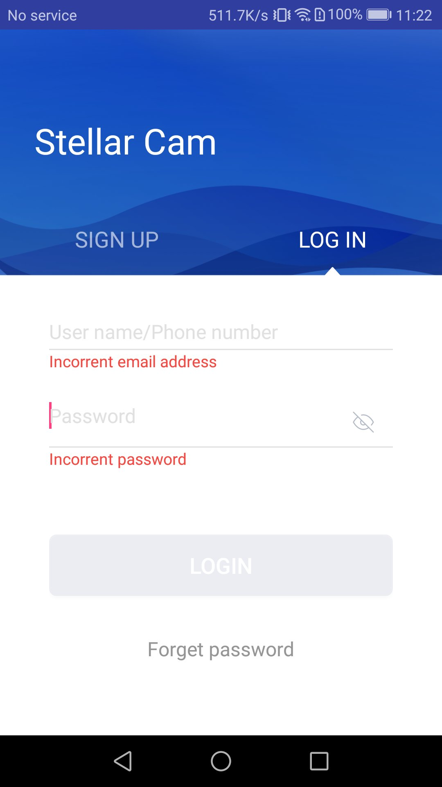

* 输入邮箱和登录密码，点击注册账号，注册成功后将自动登录到APP主页。

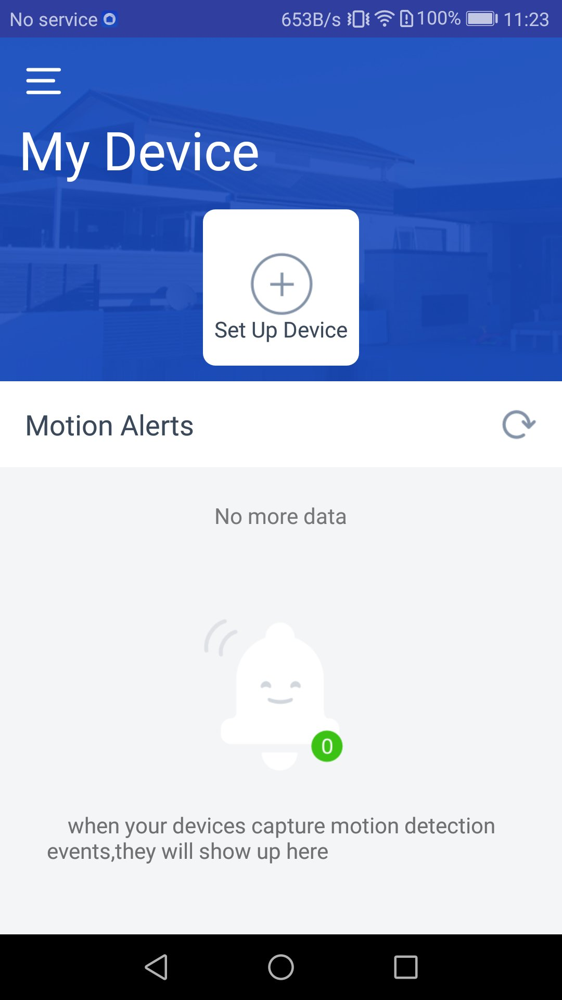

### 2. 账号管理
* 点击侧边栏中的编辑图标进入用户信息界面，修改昵称、邮件和密码。

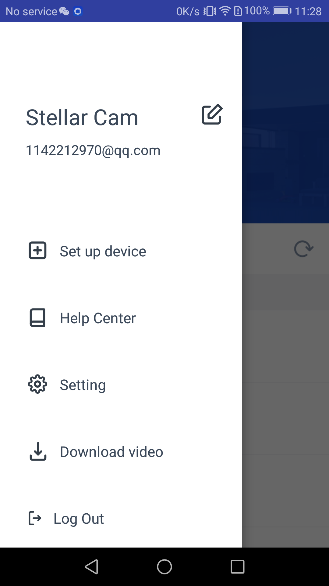
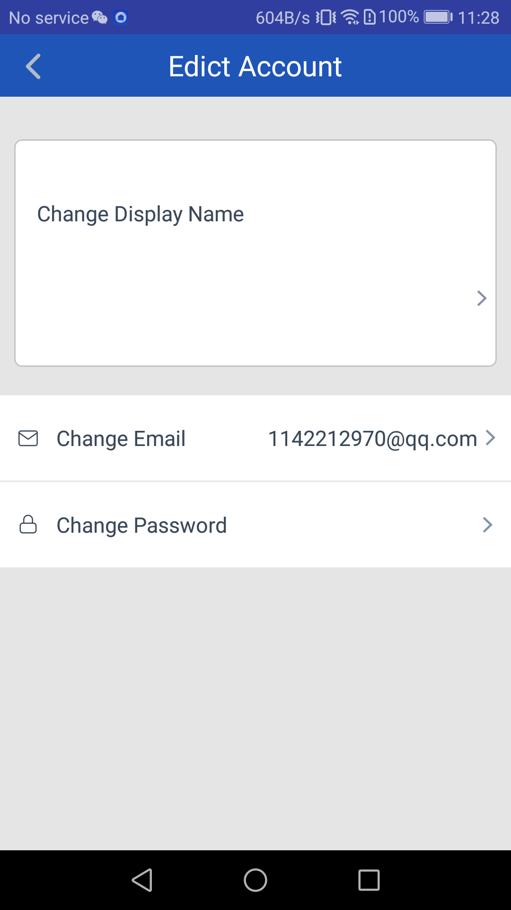

* 点击侧边栏中的 设置 进入设置界面。

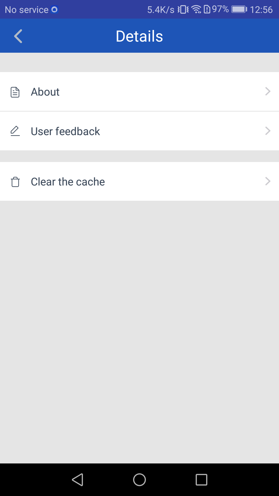

* 在关于我们界面，你可以访问我们公司的官网，或者发邮件联系我们。

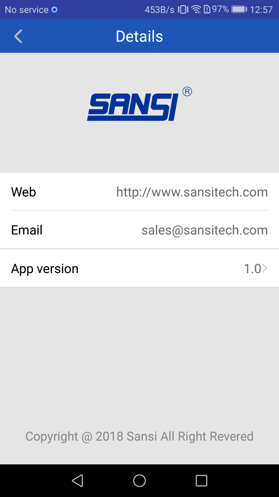
	
### 3. 添加设备

1. 点击中间 "＋" 或者侧边栏的Set up device。
2. 设置设备名称

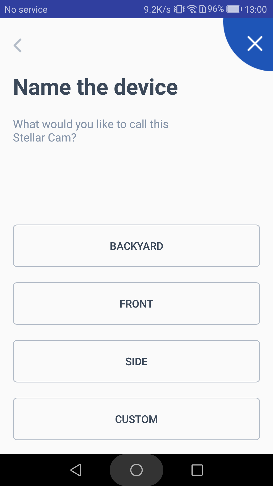

3. 查看操作指南

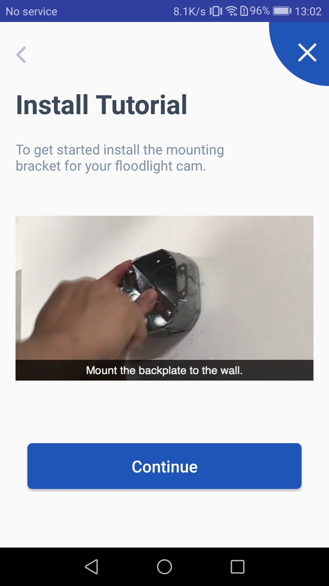

4. 选择目标网络，设置密码，最后点击保存按钮，将安防灯加入目标网络，此操作可能需要1分钟左右

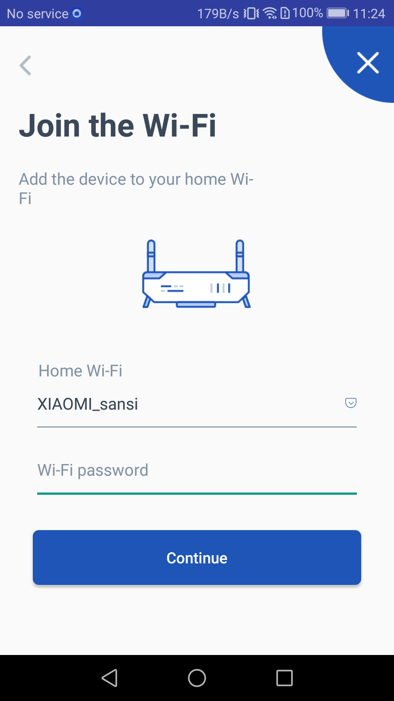

5. 当提示连接成功后，返回Security-Light主界面，就能找到在列表中找到灯啦。(如果多次刷新列表都没有找到灯，请重新尝试上述步骤)

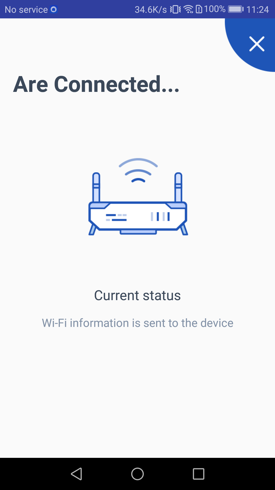

### 4. 视频播放

1. 播放报警视屏，点击右上角可以下载该视屏，在侧边栏的Download video中查看已下载的视屏

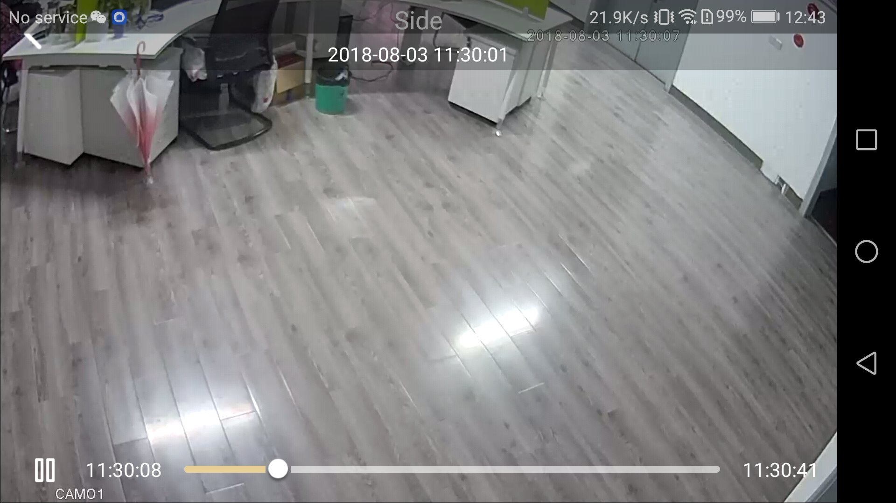

### 5. 设备

1. 点击设备，进入设备详情。
2. 点击上部图片进去直播界面。
3. SIREN使设备发出警铃声，直至主动关闭。
4. MOTION ALERTS 配置是否接收手机报警推送
5. LIGHTS控制灯的开关。

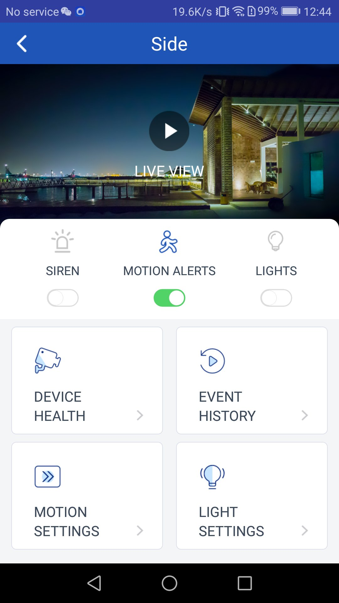

### 6. 在线直播

1. 查看摄像头实时画面
2. 右上角可选择画面的清晰度
3. 控制灯，警铃的开关
4. 按住话筒按钮可进行实时对讲

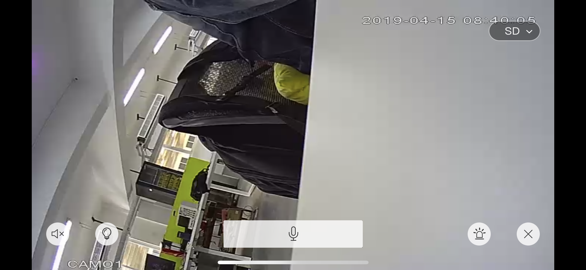
	
### 7. 设备详情

1. 可以修改设备名称
2. 查看设备MAC地址
3. 设备硬件升级
4. 设备软件升级
5. 删除设备

 	
### 8. 历史视频

1. 可以查看30天内报警视频

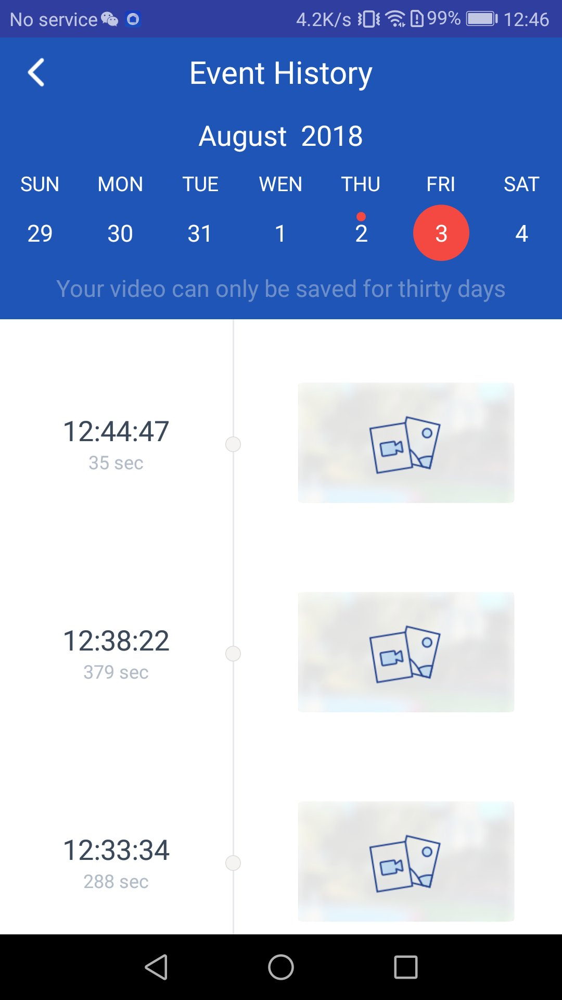

### 9. 运动检测设置

1. 设置是否开启报警及视屏的录制
2. 设置摄像头灵敏度

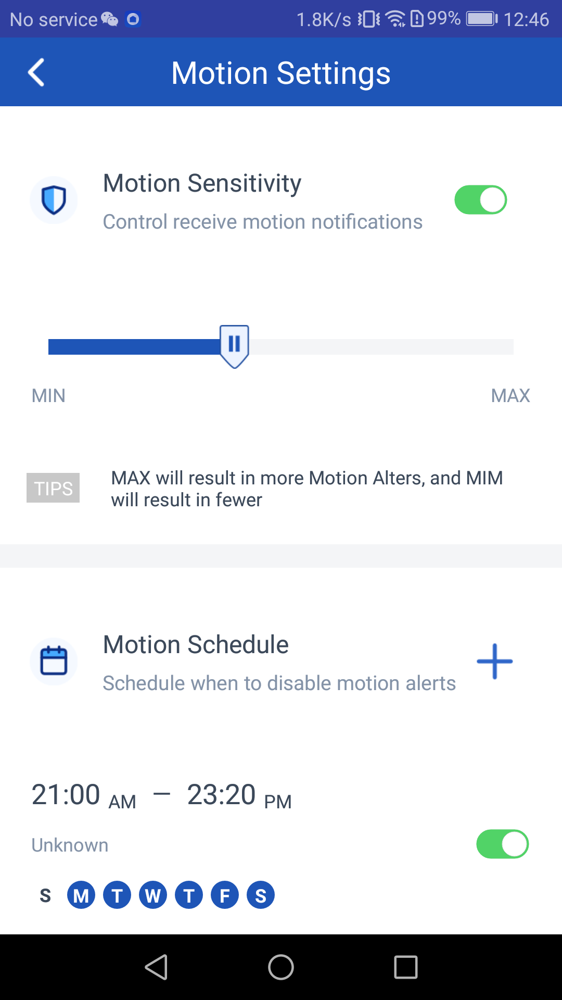

3. 设置禁止报警及视屏的录制的时间段

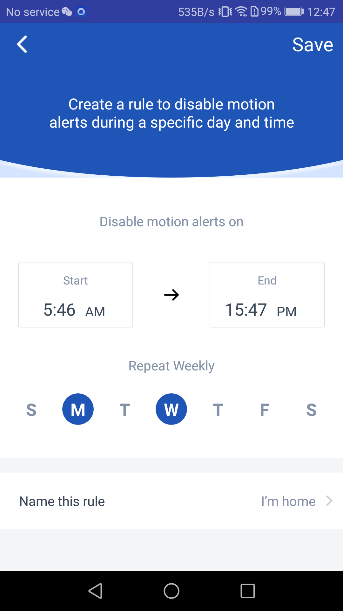
	
### 10. 灯光设置

1. 设置自动开灯的时间段，一般设置成晚上

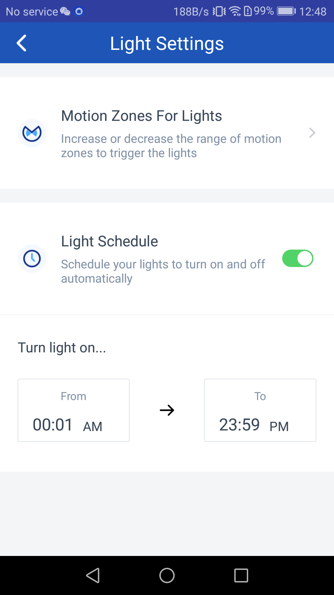

2. 设置红外感应的范围及区域
3. 设置灯亮起的持续时间

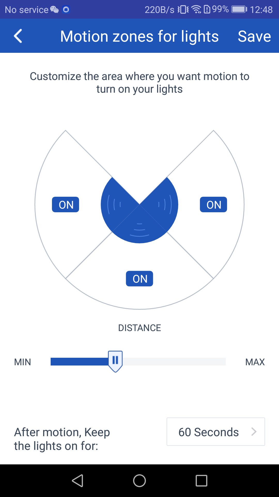

