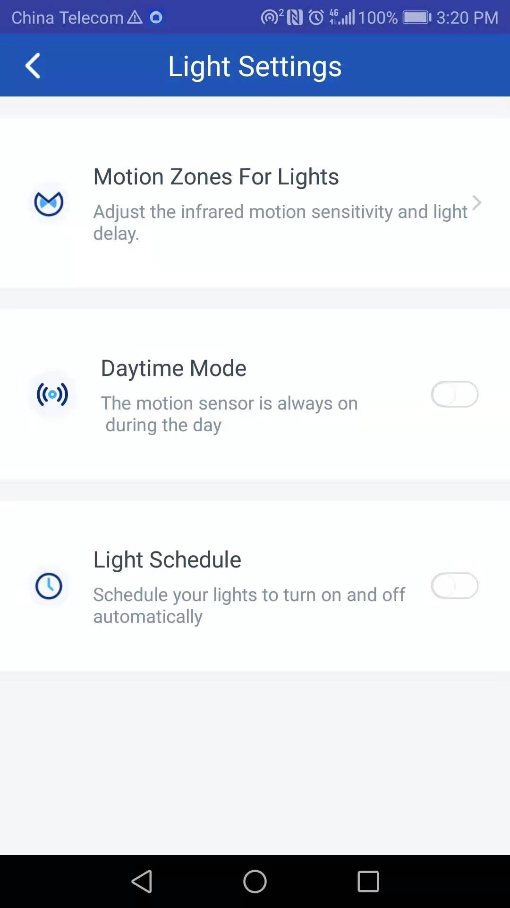

# Stellar Cam Support

## Introduction

Stellar Cam is an intelligence security lighting system; with the mobile phone the users can control the light and the camera. The system features: real-time camera monitoring, real-time intercom, automatic video recording / saving suspicious events, alert push-notification to mobile phone, alarm buzzing, time-setting for switching on/off, infrared sensing etc.

## Getting the App

* iOS users: search the App Stellar Cam in the App Store and then install it. 
* Android users: search the App Stellar Cam in the Google Play and then install it. 
* Or scan the below QR code for downloading the App.

## Installing the product

Fix the product at a proper position. Then adjust the product / camera to a suitable position and then connect the product with the power supply.

## Introducing the App

### 1. Registering the account

* Open the App Stellar Cam and then click “SIGN UP”. If the account already exists, then click “LOG IN” to log in to your account directly.

* Type in the email address and password, and then click “SIGN UP”. It logs in to the account automatically and switches to App homepage after successful registration.

### 2. Managing the account
* Click the icon ＠ in the sidebar to access the account information for editing the display name, email address and password. 

* Click the “Setting” in the sidebar to access the setting.

* In the “About”, you can visit the official web page of our company or contact us via the email.

	
### 3. Adding a device

1. Click the “＋” in the middle or “Set up device” in the sidebar.
2. Set up the description of the device.

3. Reading the install tutorial

4. Select the Wi-Fi network, set up the password and then click “Save” to add the device to the Wi-Fi network. This procedure needs approximately 1 minute. 

5. If the connection is successfully set up, go back to the App homepage and you will find the device in the list. If you cannot find the device after refreshing the list for several times, repeat the procedure as above mentioned.

### 4. Playing the video

1. Playing the alert video. For downloading the video click the top-right corner. Watch the downloaded video in the “Download video” in the sidebar.

### 5. Device

1. Click the device to access the device details.
2. Click the upper image to access the live video.
3. SIREN: alarm buzzing until manually switched off.
4. MOTION ALERTS: configuring whether the mobile phone receives alert push-notification.
5. LIGHTS: switching on / off the product

### 6. Online live-video

1. Watching the real-time monitoring screen via the camera.
2. Selecting the options of the video resolution  on the top-right side.
3. Switching on / off the product and the alarm buzzer.
4. Keeping the microphone button pressed for real-time intercom.

	
### 7. Device details

1. Changing the description of the device
2. Checking the MAC address
3. Upgrading the hardware
4. Updating the software
5. Deleting the device

 	
### 8. Event history

1. The alert videos can be saved for 30 days.

### 9. Setting the motion

1. Setting whether switching on the alert and video record functions.
2. Setting the motion sensitivity of the camera.

Setting the time period for disabled alert and video record functions.

	
### 10. Setting the light

1. Setting the time period for automatic switching-on, usually set the night as the time period.
2. Setting the daytime mode, the light will switch on when infrared sensors detected motion if daytime mode is on. 

3. Setting the coverage range and area of the infrared sensing. 
4. Setting the light-up duration time of the light.

