# Stellar Cam Support

## Introduction

Stellar Cam is an intelligent security lighting system. With your mobile phone you can control the light and the camera. The system features: real-time camera monitoring, real-time intercom, automatic video recording/saving suspicious events, alert push notifications to your mobile phone, alarm sounding, scheduling for switching on/off, infrared sensing etc.

## Getting the App

* iOS users: Search the Stellar Cam App in the App Store and then install it.  
* Android users: Search the Stellar Cam App in the Google Play store and then install it. 
* Or scan the QR code below to download the App. 

## Installing the product

Fix the product and the camera to suitable positions. Then connect the product with the power supply.

## Introducing the App

### 1. Registering your account

* Open the Stellar Cam App and click “SIGN UP”. If you have an existing account, then click “LOG IN”. 

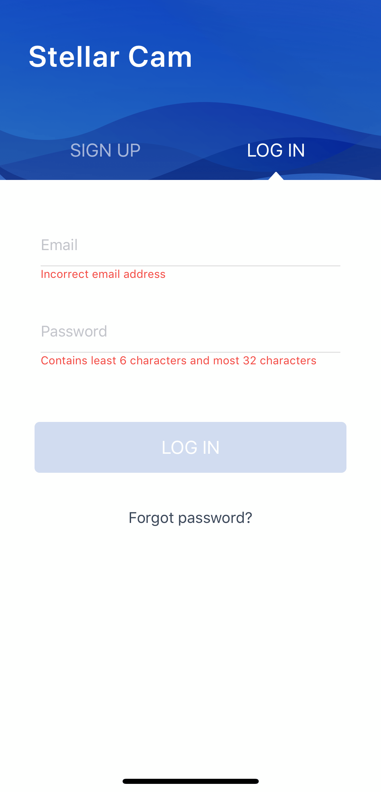

* Type in your email address and password. Then click “SIGN UP”. This logs into the account automatically and switches to the App homepage after a successful registration. 

### 2. Managing the account
* Click the icon ＠ in the sidebar to access the account information for editing the display name, email address and password. 

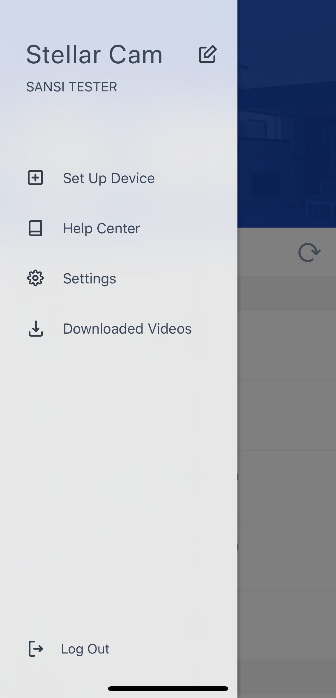
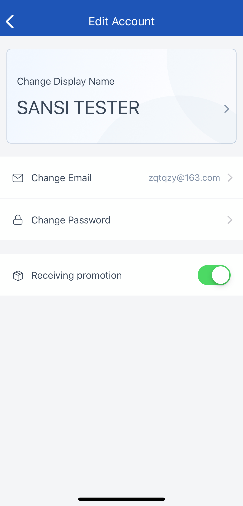

* Select “Settings” in the sidebar to access the setting.

* In “About” you can visit the SANSI official website and contact us via email. 

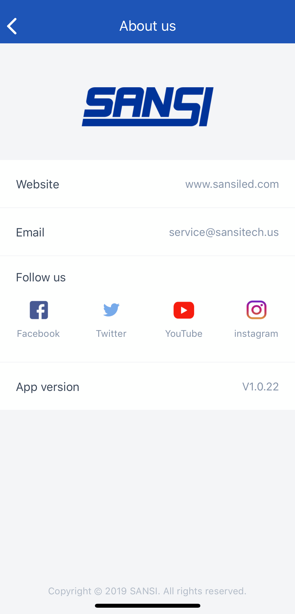
	
### 3. Adding a device

1. Click the “＋” in the middle or “Set up device” in the sidebar.
2. Set up the description of the device.

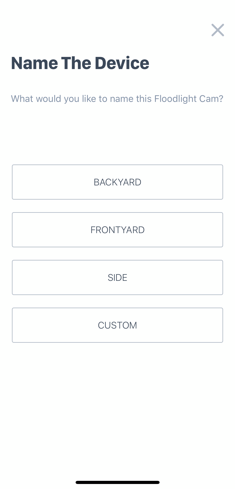

3. Reading the install tutorial

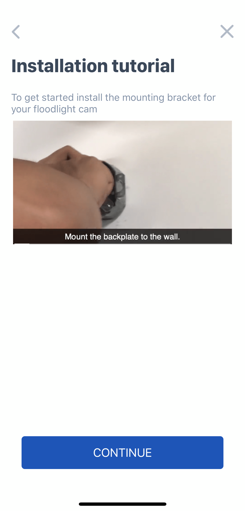

4. Select the Wi-Fi network, set up the password and then click “Save” to add the device to the Wi-Fi network. This procedure takes approximately 1 minute. 

5. If the connection is successfully set up, go back to the App’s homepage and you can find the device list. If you cannot find the device after refreshing the list several times, repeat the procedure as mentioned above.

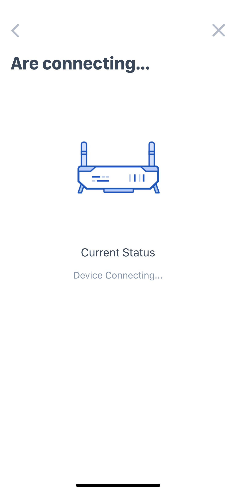

### 4. Playing motion alert videos

1. Playing motion alert videos. To download the video select the button in the top right corner. You can watch the downloaded video in the “Downloaded videos” sidebar. 

### 5. Devices

1. Click the device to access the device details.
2. Click the upper image to access the live video.
3. SIREN: Alarm sounds until manually switched off.
4. MOTION ALERTS: Configure the phone to receive motion alert push notifications. 
5. LIGHTS: switching on / off the product

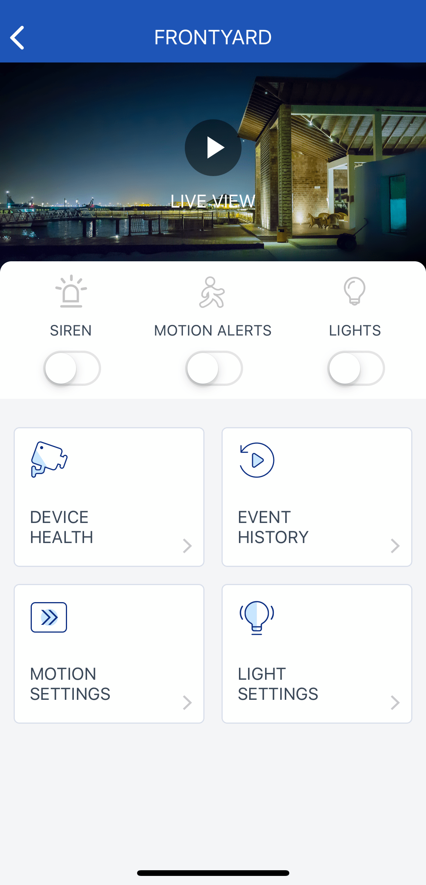

### 6. Online live-video

1. Watch real-time monitoring videos via the camera. 
2. Select the video resolution on the top-right side of the screen.
3. Switch on/off the product and the alarm sound.
4. Hold the microphone button for real-time intercom.

	
### 7. Device details

1. Change the description of the device
2. Check the MAC address
3. Upgrade the hardware
4. Update the software 
5. Delete the device

 	
### 8. Event history

1. The alert videos can be saved for 30 days.

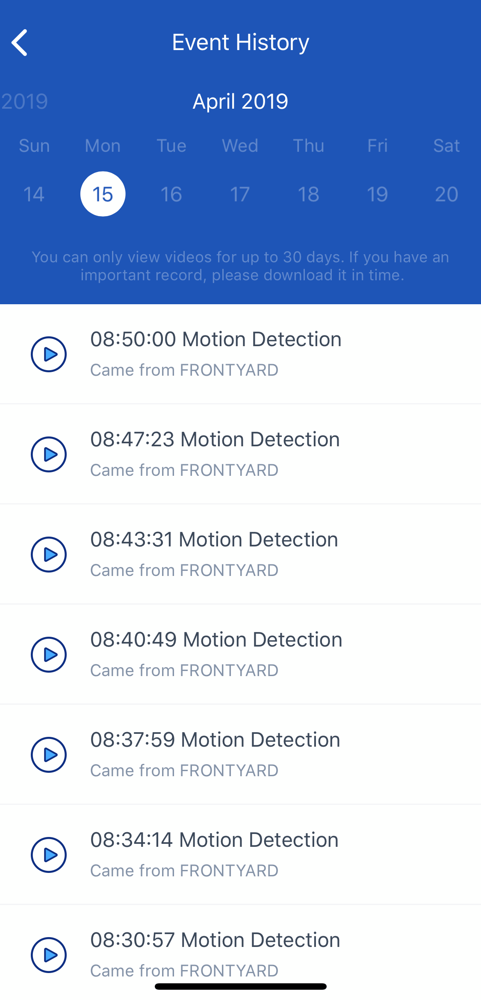

### 9. Motion Settings

1. Setting alerts and video record functions. 
2. Setting the motion sensitivity of the camera.

Setting the time period for disabled alert and video record functions.

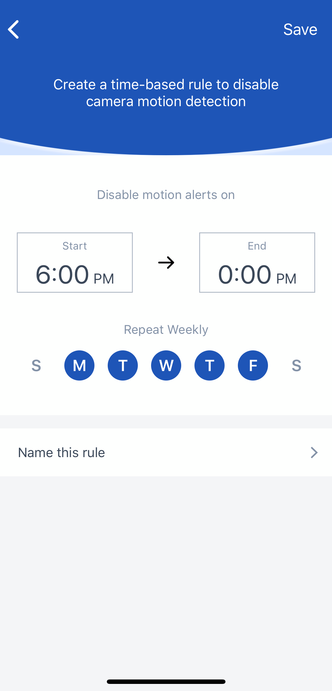
	
### 10. Light Settings 

1. Setting the time period for automatic switching-on, usually set the night as the time period.
2. Setting daytime mode. The light will switch on when infrared sensors detect motion if daytime mode is on. 

3. Setting the coverage range and area of the infrared sensing. 
4. Setting the light-up duration time of the light.

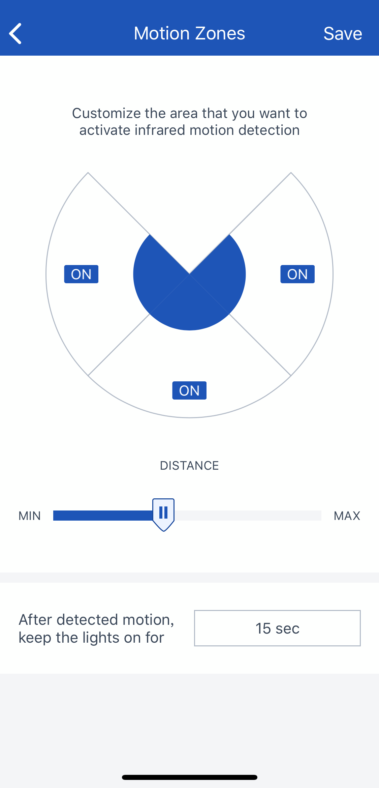

